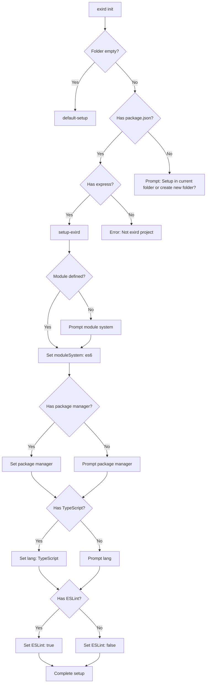

## Exird-addons

This is an addons package, that extends the functionality of exirdjs, containing most of the functions that are shared between the scaffolding and the cli package.

### Actions

Exird addons export functions to another package called exird which is actually a cli tool.

### Initialization

```
npx exird init
```

When initializing exird project it will need to do this steps

- create `.exird/workflows` folder
- create `.exird/exird.config.json` file
- create `.exird/workflows/exirdjs.yml` folder

This will check a project for the following



### Actions

Actions are code snippets that run commands and make changes to the code base.

The above flow chart can actually be placed inside an action
we are going to actually set it up

This is how actions work

- Create folder with the name of the action e.g. `setup-exird`
- Create action.ts folder as entry point into action.
- Create scripts.ts folder
- Create an

the user can run local workflow like this

```
exird run --workflow workflow-name
```

It will get the local workflows and ask you which one you want to run if
there is more than one

```
exird run --action setup-exird
```

This will check exird for the workflow being looked for.

Difference between workflows and actions is that actions can integrate the process fully
but workflows run step by step
